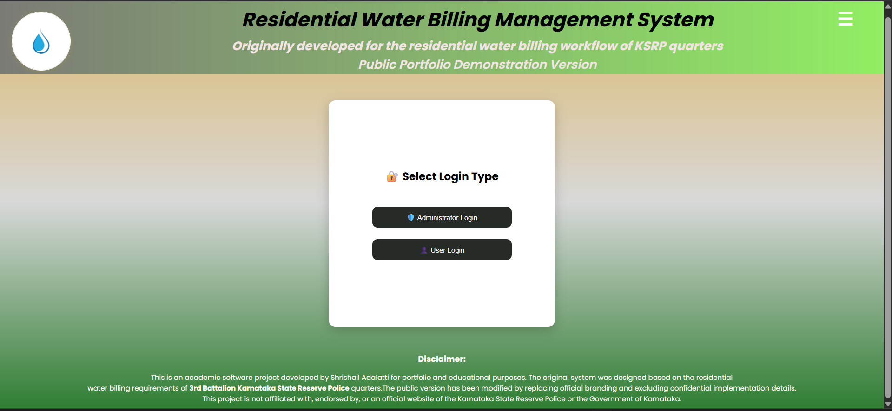
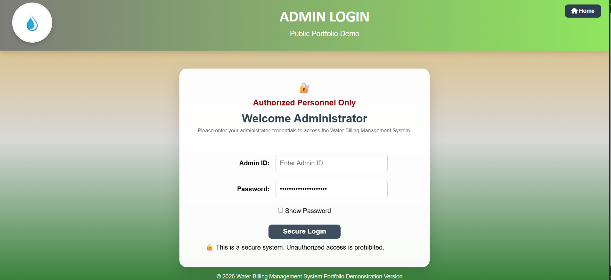
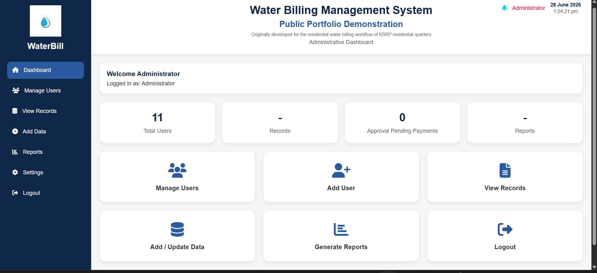
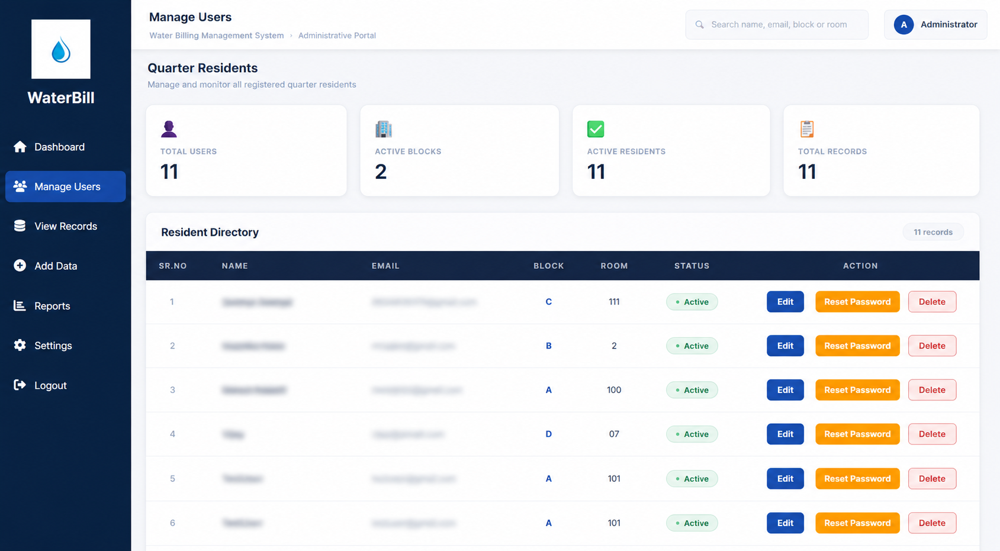
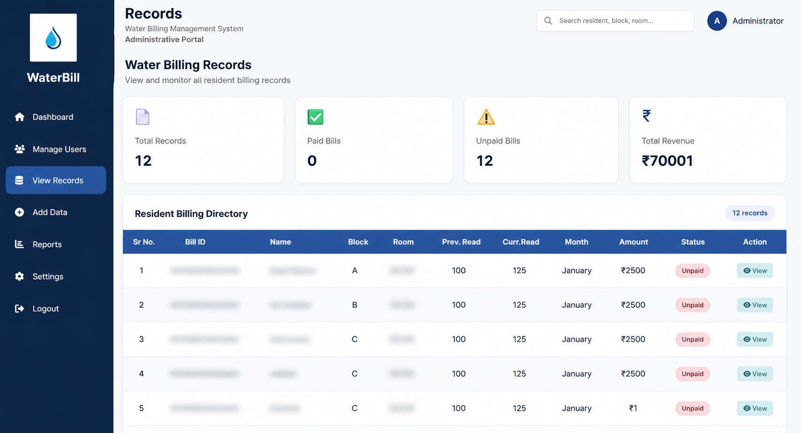
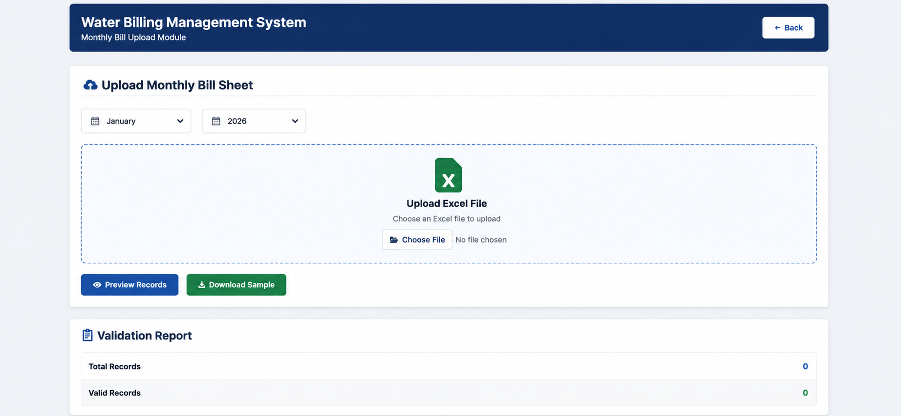
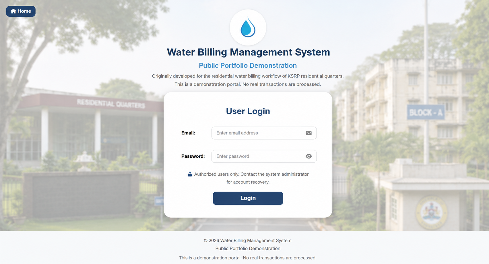
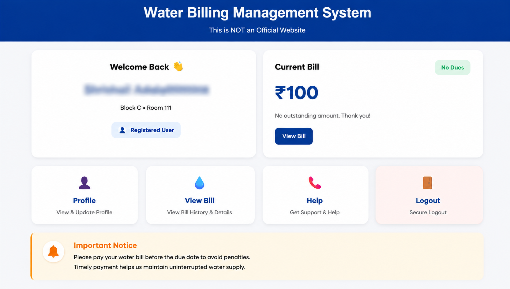

# 💧 Water Billing Management System

A full-stack Water Billing Management System built using **Node.js, Express.js, MongoDB, EJS, HTML, CSS, and JavaScript**.

This project was originally developed based on the water billing workflow of **Karnataka State Reserve Police (KSRP) residential quarters**. The goal was to replace the manual billing process with a simple and easy-to-use web application for both administrators and residents.

> **📌 Public Portfolio Version**
>
> This repository is a public portfolio version of the original project. The backend source code, database models, server implementation, and other confidential files have been removed. This repository is only meant to demonstrate the project's design, features, workflow, and user interface.

---

# 📖 Project Overview

The system provides separate portals for administrators and residents.

Administrators can manage residents, upload monthly water bills, monitor payment status, and generate reports.

Residents can securely log in, view their monthly bills, and check their payment status.

The project helped me understand how a complete full-stack application is designed, from authentication and database management to dashboard development and user-friendly interfaces.

---

# 💡 Why I Built This

During a visit to KSRP residential quarters with my brother, I noticed that water billing records were being managed manually.

That inspired me to build a web application that demonstrates how the same process can be handled digitally, making it easier to manage residents, bills, and reports from a single platform.

---

# ✨ Features

## 👨‍💼 Administrator Portal

- Secure Administrator Login
- Dashboard with billing statistics
- Add, update, and remove residents
- Upload monthly water bills
- View resident billing records
- Generate reports
- Track payment status
- Reset resident passwords

---

## 👤 Resident Portal

- Secure User Login
- View monthly water bills
- Check payment status
- View bill details
- Profile page
- Help & Support section

---

# 🛠️ Tech Stack

### Frontend

- HTML
- CSS
- JavaScript
- EJS

### Backend

- Node.js
- Express.js

### Database

- MongoDB
- Mongoose

### Other Libraries

- Express Session
- bcrypt
- Multer
- XLSX
- QRCode
- dotenv

---

# ⚙️ How the System Works

```text
                 User / Administrator
                          │
                          ▼
                    Login System
                          │
            ┌─────────────┴─────────────┐
            ▼                           ▼
     Administrator Portal         Resident Portal
            │                           │
            ▼                           ▼
     Manage Residents             View Water Bills
     Upload Bills                 Check Payment Status
     Generate Reports             View Bill Details
            │
            ▼
      Store & Retrieve Data
          (MongoDB Database)
```

---

# 📷 Project Screenshots

## 🏠 Home Page

<p align="center">

</p>

---

## 🔐 Administrator Login

<p align="center">

</p>

---

## 📊 Administrator Dashboard

<p align="center">

</p>

---

## 👥 Manage Users

<p align="center">

</p>

---

## 📄 Water Billing Records

<p align="center">

</p>

---

## 📤 Upload Monthly Bills

<p align="center">

</p>

---

## 👤 Resident Login

<p align="center">

</p>

---

## 💧 View Water Bill

<p align="center">

</p>

---

# 🔒 About This Public Repository

The original project contains backend code, database models, authentication logic, and configuration files.

To keep the project suitable for public sharing, those files have been removed from this repository.

This repository is intended to showcase:

- Project design
- User Interface
- Dashboard pages
- System workflow
- Features
- Technologies used
- Overall project structure

---

# 🚀 Future Improvements

- Email Notifications
- WhatsApp Notifications
- PDF Bill Generation

